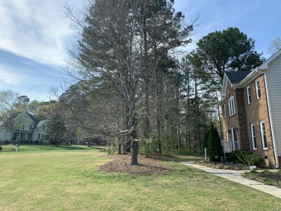
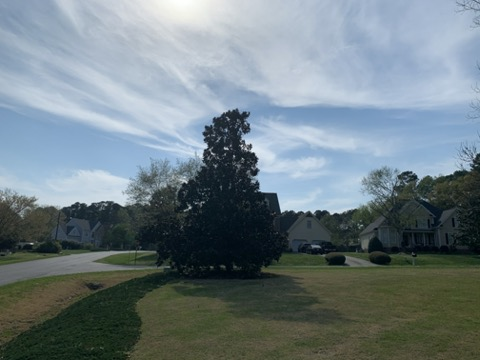
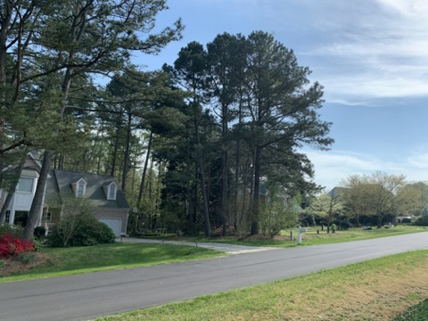
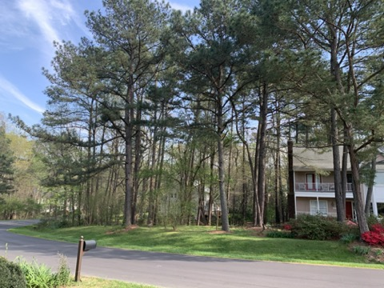
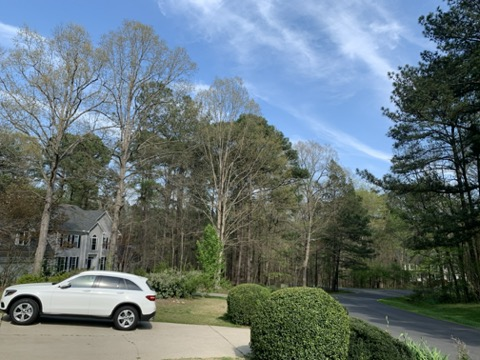

# CS5670 Computer Vision Projects and Artifacts

## Project 1: Hybrid Images 

### Introduction

Creating hybrid images using a series of image filters. Hybrid images are static, but show different images depending on how far you are away from the picture.

* High pass filtered version of picture 1
* Low pass filtered version of picture 2
* Blended hybrid image of aligned picture 1 and 2

Detailed project description can be found [here](http://www.cs.cornell.edu/courses/cs5670/2020sp/projects/pa1/index.html).

### Steps

1. cross_correlation_2d
2. convolve_2d
3. gaussian_blur_kernel_2d
4. low_pass
5. high_pass
  
### Structure

| Name                  | Function                                           |
| ------------          | -------------------------------------------------- |
| /resources            | Images used to create hybrid                       |
| adjust_brightness.py  | Adjust brightness of resulting image               |
| hybrid.py             | Apply the five filters to the two images and blend |
| test.py               | Test cases provided to test and debug our code     |
| gui.py                | Gui provided to create panorama                    |

#### Libraries used

* Python version: 2.7.16
* NumPy
* SciPy


### Result: Al De Niro

#### Final configuration 

Al Pacino (left.jpg): low pass
Robert De Niro (right.jpg): high pass

```
  "right_size": 8, 
  "left_sigma": 7.0, 
  "scale_factor": 2.0, 
  "right_sigma": 4.5, 
  "right_mode": "high", 
  "view_grayscale": 0, 
  "left_mode": "low", 
  "left_size": 13, 
  "mixin_ratio": 0.5, 
  "save_grayscale": 0
```

#### Input
|   |   |
| ------------------------------------------------------------ | ------------------------------------------------------------ |

#### Hybrid Image

|     |  
| ---------------------------------------------------------------- | --------------------------------------- |
     
      
   
     
      
## Project 2: Feature Detection & Matching 

### Introduction

Detecting image features and matching pairing features across images.

* Feature detection using Harris
* Feature description (simple and MOPS)
* Feature matching (SSD and ratio)

Detailed project description can be found [here](http://www.cs.cornell.edu/courses/cs5670/2020sp/projects/pa2/index.html).

### Steps

1. Compute Harris corner strength at each pixel for source image
2. Find local maxima 
3. Implement Simple Feature Descriptor and MOPS (Multi-Scale Oriented Patches) Descriptor
4. Perform feature matching with  SSD or ratio distance
5. Benchmark the performance of the different descriptors and matching functions in an ROC curve
  
### Structure

| Name                  | Function                                           |
| ------------          | -------------------------------------------------- |
| /resources            | Images used for feature matching                   |
| features.py           | Feature detection, description and matching        |
| featuresUI.py         | Gui to visualize feature matches and benchmarks    |
| tests.py              | Test cases provided to test and debug our code     |
| transformations.py    | Image transformation functions                     |
| benchmark.py          | Code to create ROC curves                          |

#### Libraries used

* Python version: 3.7.4
* cv2 
* NumPy
* SciPy


### Result

### 1. Yosemite

#### Input

|   |   |
| ------------------------------------------------------------ | ------------------------------------------------------------ |


#### Detected features


#### Matched features

Not all matches are shown in the image (1120 matches in total)

 


### 2. Cornell Tech's Student Collaboratoy

#### Input

|     |  
| ---------------------------------------------------------------- | --------------------------------------- |

#### Matched features

Not all matches are shown (4960 matches in total)

 


### 3. Performance Benchmark

Using the MOPS Detector and Ratio matching led to the best performance with an average AUC of 0.944, followed by the  MOPS and SSD method with an AUC of 0.872. The Simple Descriptor with both Ratio matching (AUC of 0.86) and with SSD (AUC of 0.845) performed worse.

| MOPS Ratio ROC Curve | MOPS SSD ROC Curve |
| ------------------------------------------------------------ | ------------------------------------------------------------ |
|   |   |

| Simple Ratio ROC Curve | Simple SSD ROC Curve |
| ------------------------------------------------------------ | ------------------------------------------------------------ |
|     |  


## Project 3: Creating Panorama Pictures with Autostitch

### Introduction

Building our own Autostitch system to combine overlapping photographs into a single panorama

* Feature matching using ORB feature detector (opencv)

* Using RANSAC to align the photographs

* Blend the images with alpha blending (feathering)

* Correcting for drift and create 360° panoramas 

Detailed project description can be found [here](http://www.cs.cornell.edu/courses/cs5670/2020sp/projects/pa3/index.html).

### Steps

1. Take pictures with a camera / phone

2. Warp to spherical coordinates

3. Extract features

4. Match features

5. Align neighboring pairs using RANSAC

6. Write out list of neighboring translations

7. Correct for drift

8. Read in images and blend them

9. Crop the result and import into a viewer
  
### Structure

| Name         | Function                                        |
| ------------ | ----------------------------------------------- |
| /resources   | Images used to create panoramas                 |
| warp.py      | Warp images into spherical coordinates.         |
| alignment.py | Compute the alignment of image pairs.           |
| blend.py     | Stitch and blend the aligned images.            |
| test.py      | Test cases provided to test and debug our code  |
| gui.py       | Gui provided to create panorama                 |

#### Libraries used

* Python version: 3.7.4
* cv2
* NumPy
* SciPy


### Results

### 1. Yosemite

#### Input
|  |  |
| ------------------------------------------------------------ | ------------------------------------------------------------ |
|  |  |

#### Panorama


### 2. Our own pictures

#### Input

These pictures were taken with the iPhone XR with 4.25mm focal length and CCD (sensor) width of 5.66m


|  |  |  |  |
| ------------------------------ | ------------------------------ | ------------------------------ | ------------------------------ |
|  |  |  |  |
|  |  |  |  |
|  |  |||

#### Panorama

The final 360 panorama looks a bit blurry because we did not have a tripod, i.e. the horizontal movement is not as consistent and we were not able to fully correct for the distortion. We used a blend width of 200 pixels and a translation to create the panorama.


